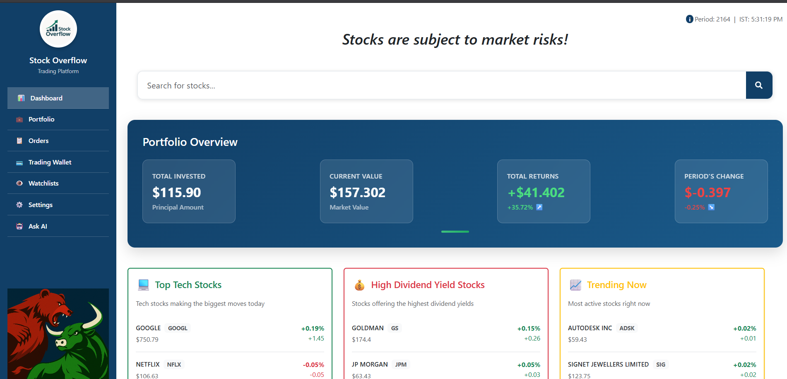
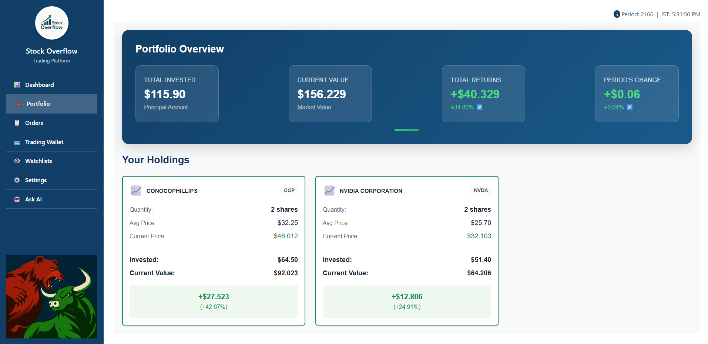
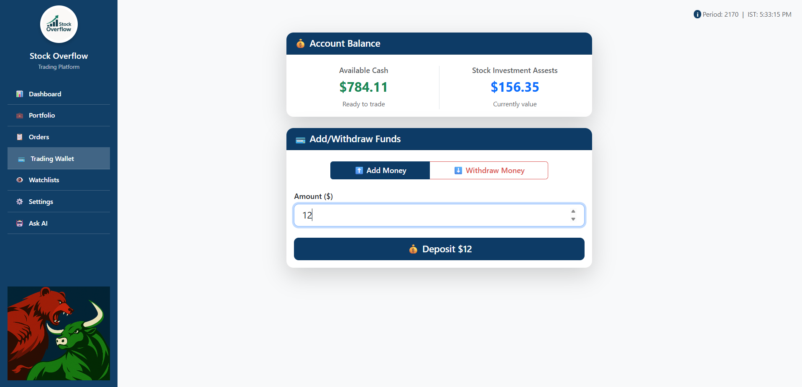
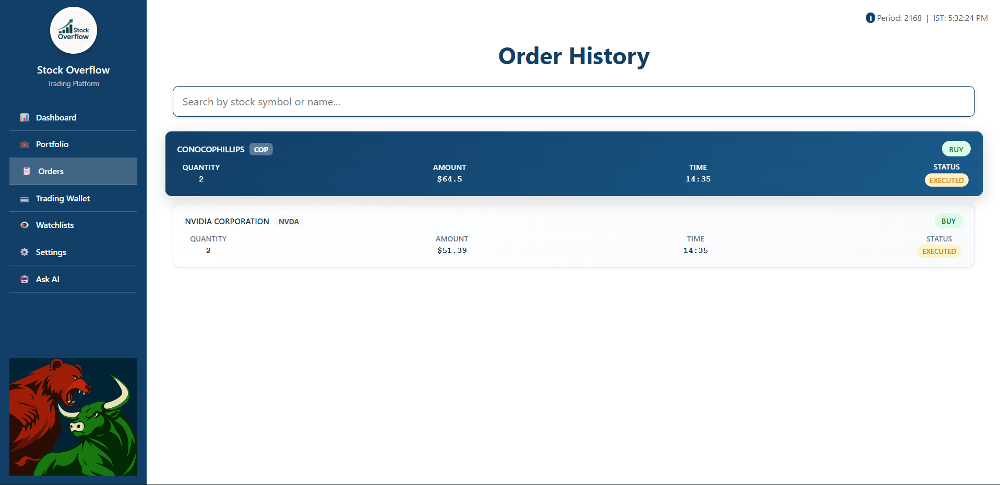
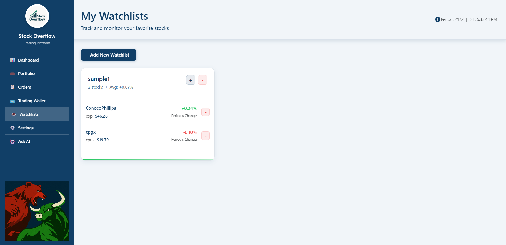
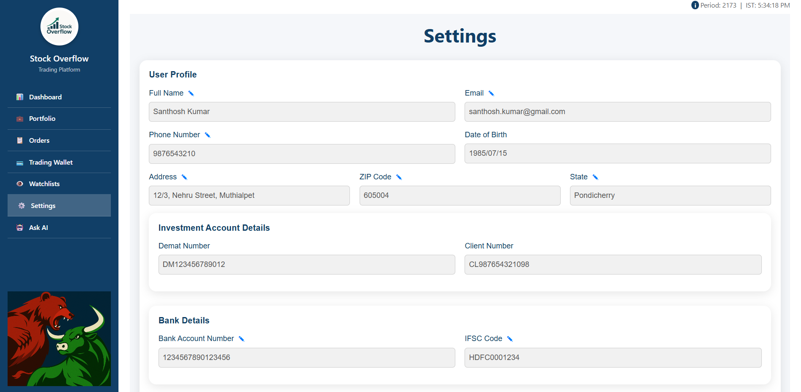
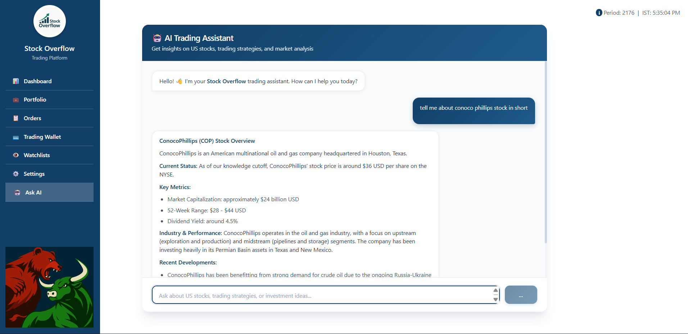

# Stock Overflow - Frontend

A comprehensive stock trading platform built with React and Spring Boot, featuring real-time market data, portfolio management, and AI-powered trading assistance.



## 🚀 Features

- **Real-time Dashboard** - Live market data and portfolio overview
- **Portfolio Management** - Track your investments and performance
- **Trading Interface** - Buy and sell stocks with ease
- **Order Management** - View and manage your trading orders
- **Watchlists** - Monitor your favorite stocks
- **Settings** - Customize your trading experience
- **AI Trading Assistant** - Get intelligent trading insights powered by Ollama

## 📸 Screenshots

### Dashboard

*Main dashboard with market overview and portfolio summary*

### Portfolio

*Portfolio management and performance tracking*

### Trading Waller

*Manage your funds*

### Order Management

*View and manage all your trading orders*

### Watchlists

*Monitor your favorite stocks and market movements*

### Settings

*Customize your trading preferences and account settings*

### AI Assistant

*Get intelligent trading insights from our AI assistant*

## 🛠️ Prerequisites

Before running this application, ensure you have the following installed:

- **Node.js** (v14 or higher)
- **npm** or **yarn**
- **Ollama** (for AI chatbot functionality)
- **Backend Server** - Make sure your Spring Boot backend and MySQL server are running

> **Note**: This frontend service is designed to work with the [Stocks Overflow Backend](https://github.com/sachinprasanna7/StockOverflow-backend). Please ensure the backend is running before starting the frontend.

## 📦 Installation & Setup

### Step 1: Install React Dependencies

Clone the repository and install the required dependencies:

```bash
# Clone the repository
git clone <your-repository-url>
cd stocks-overflow-frontend

# Install dependencies
npm install

# Or using yarn
yarn install
```

### Step 2: Start the React Development Server

Launch the React application:

```bash
# Start the development server
npm start

# Or using yarn
yarn start
```

The application will be available at `http://localhost:3000`

### Step 3: Run the Proxy Server

The proxy server handles API requests and provides additional functionality. Run it in a separate terminal:

```bash
# Navigate to the project root (if not already there)
cd stocks-overflow-frontend

# Run the proxy server
node proxy-server.js
```

> **Important**: Keep this terminal window open while using the application.

### Step 4: Setup Ollama for AI Assistant

The AI trading assistant requires Ollama to be installed and configured:

#### 4.1 Install Ollama

Download and install Ollama from [https://ollama.ai](https://ollama.ai)

#### 4.2 Create the Trading Assistant Model

Navigate to the model directory and create the custom trading assistant:

```bash
# Navigate to the model directory
cd src/model

# Create the trading assistant model
ollama create trading-assistant -f Modelfile

# Run the trading assistant
ollama run trading-assistant
```

#### 4.3 Verify Ollama Setup

Ensure Ollama is running on the default port (11434):

```bash
# Test if Ollama is accessible
curl http://localhost:11434/api/tags
```

## 🔧 Configuration

### Backend Configuration

Ensure your backend server is configured with the following endpoints:

- **API Base URL**: `http://localhost:8080`
- **Database**: MySQL running on default port (3306)
- **CORS**: Enabled for `http://localhost:3000`

## 🚀 Running the Complete Application

### Option 1: Docker (Recommended)

The easiest way to run the application is using Docker. This method handles all dependencies and services automatically.

#### Prerequisites for Docker
- **Docker** installed on your system
- **Docker Compose** installed
- **Ollama** (still needs to be installed separately for AI functionality)

#### Steps to Run with Docker

1. **Ensure Backend is Running** (separate repository)
   - Make sure your Spring Boot backend and MySQL are running

2. **Setup Ollama for AI Assistant**
   ```bash
   # Install Ollama (if not already installed)
   # Download from https://ollama.ai
   
   # Create the trading assistant model
   cd src/model
   ollama create trading-assistant -f Modelfile
   ollama run trading-assistant
   ```

3. **Build and Run with Docker Compose**
   ```bash
   # Build and start all services
   docker-compose up --build
   
   # Or run in detached mode (background)
   docker-compose up -d --build
   ```

4. **Access the Application**
   - Frontend: `http://localhost:3000`
   - Backend API: `http://localhost:8080` (external)
   - Ollama API: `http://localhost:11434` (external)

#### Docker Commands

```bash
# Start services
docker-compose up

# Start services in background
docker-compose up -d

# Stop services
docker-compose down

# Rebuild and start
docker-compose up --build

# View logs
docker-compose logs

# View logs for specific service
docker-compose logs frontend
```

#### Docker Services
The `compose.yaml` includes:
- **Frontend React App** - Port 3000
- **Proxy Server** - Integrated with frontend container

### Option 2: Manual Setup (Development)

For development or manual setup:

1. **Start Backend Services** (separate repository)
   - Start MySQL server
   - Start Spring Boot application

2. **Start Frontend Services** (this repository)
   ```bash
   # Terminal 1: Start React app
   npm start
   
   # Terminal 2: Start proxy server
   node proxy-server.js
   
   # Terminal 3: Start Ollama (if not running as service)
   ollama run trading-assistant
   ```

3. **Access the Application**
   - Frontend: `http://localhost:3000`
   - Backend API: `http://localhost:8080`
   - Ollama API: `http://localhost:11434`

## 🐛 Troubleshooting

### Common Issues

#### Manual Setup Issues

**React App Won't Start**
- Check if port 3000 is available
- Ensure all dependencies are installed: `npm install`

**Proxy Server Issues**
- Verify the proxy server is running: `node proxy-server.js`
- Check if port 3001 is available

#### Docker Issues

**Docker Build Fails**
- Ensure Docker is running: `docker --version`
- Check if ports 3000 are available
- Try rebuilding: `docker-compose build --no-cache`

**Container Won't Start**
- Check Docker logs: `docker-compose logs`
- Ensure sufficient disk space
- Verify Docker Compose file syntax

**Port Conflicts**
- Stop other services using port 3000
- Modify ports in `compose.yaml` if needed

#### Common to Both Setups

**AI Assistant Not Working**
- Ensure Ollama is installed and running
- Verify the trading-assistant model is created: `ollama list`
- Check if port 11434 is accessible

**Backend Connection Issues**
- Confirm the Spring Boot backend is running
- Check MySQL database connection
- Verify CORS settings in backend

### Error Messages

**"Unable to connect to the AI service"**
- Restart Ollama: `ollama run trading-assistant`
- Check if port 11434 is open

**"Network Error" or "API Error"**
- Verify backend server is running
- Check proxy server status
- Confirm environment variables are set correctly


## 📞 Contributers

For support and questions:

- Khushi Suresh Muddi
- Prerak Varshney
- Sruthi R
- Sachin Prasanna

